# ⚔️ GOLDEN ARMADA
> *The Ultimate Agentic Swarm Architecture*

[](https://www.python.org/downloads/)
[](https://deepmind.google/technologies/gemini/)
[](./codeswarm/agents/armada/)

**Golden Armada** is a massive, orchestrated swarm of 222+ specialized AI agents designed to autonomously collaborate and solve complex problems. Built on the `Agno` framework and powered by Google's **Gemini 3.0**, it features a sophisticated "Chain of Command" architecture that routes tasks from a central Orchestrator to highly specific domain experts.

---

## 🚀 Key Features

*   **Massive Scale**: 222+ Specialized Agents covering Backend, Frontend, DevOps, Legal, QA, Data, and more.
*   **Intelligent Orchestration**: A central `OrchestratorAgent` uses **Category Routing** to dynamically filter and select the perfect team for any task.
*   **Gemini 3.0 Optimized**: Configured to use `Gemini 3.0 Pro` for reasoning/planning and `Gemini 3.0 Flash` for high-speed execution.
*   **Gatekeeper Security**: Integrated `SecurityAboyeur` for prompt injection protection and safety.
*   **Memory Integration**: `Khala` memory layer (PostgreSQL/SurrealDB) for context persistence.

## 🏛️ Architecture

The system follows a strict hierarchy to ensure scalable cognitive processing:

```mermaid
graph TD
    User[User] -->|Request| Gatekeeper[🛡️ Security Gatekeeper]
    Gatekeeper -->|Clean Request| Orchestrator[🧠 Orchestrator]
    Orchestrator -->|Category Routing| Registry[🗂️ Agent Registry]
    Registry -->|Filtered Candidates| Orchestrator
    Orchestrator -->|Delegation| Specialist[👷 Specialist Agent]
    
    subgraph "The Golden Armada (222+ Agents)"
        Specialist --> Backend[Backend Agents]
        Specialist --> Frontend[Frontend Agents]
        Specialist --> Data[Data Agents]
        Specialist --> Ops[DevOps Agents]
        Specialist --> QA[QA Agents]
    end
```



## 🛠️ Getting Started

### Prerequisites

*   Python 3.10+
*   Google Gemini API Key

### Installation

1.  **Clone the Repository**
    ```bash
    git clone https://github.com/your-repo/golden-armada.git
    cd golden-armada
    ```

2.  **Install Expectations**
    ```bash
    pip install -r requirements.txt
    ```

3.  **Configure Environment**
    Create a `.env` file:
    ```ini
    GEMINI_API_KEY=your_key_here
    GEMINI_MODEL_FAST="gemini-3-flash-preview"
    GEMINI_MODEL_REASONING="gemini-3-pro-preview"
    ```

### Usage

**Run the Orchestrator** (The Brain):

```python
import asyncio
from codeswarm.agents.orchestrator_agent import OrchestratorAgent

async def main():
    orchestrator = OrchestratorAgent()
    
    # Task: Something complex that requires specialization
    task = "Create a FastAPI backend for a Bookstore, including tests."
    
    # The Orchestrator will:
    # 1. Route to 'Backend' and 'QA' categories
    # 2. Select ApiArchitectAgent and TestWriterFixerAgent
    # 3. Generate a plan
    plan = await orchestrator.plan_workflow(task)
    print(plan)

asyncio.run(main())
```

## 📂 Project Structure

*   `codeswarm/agents/orchestrator_agent.py`: The Main Brain.
*   `codeswarm/agents/armada/`: The fleet of 222+ agents, organized by category (`backend`, `frontend`, `marketing`, etc.).
*   `codeswarm/core/registry.py`: The discovery engine.
*   `codeswarm/tests/manual_verification/`: Verification scripts.

## 🤝 Contributing

The Golden Armada is ever-expanding. To add a new agent:
1.  Create your agent in `codeswarm/agents/armada/<category>/`.
2.  Inherit from `SwarmAgent`.
3.  The Registry will automatically discover it on the next run!

## 📜 License

MIT License.
