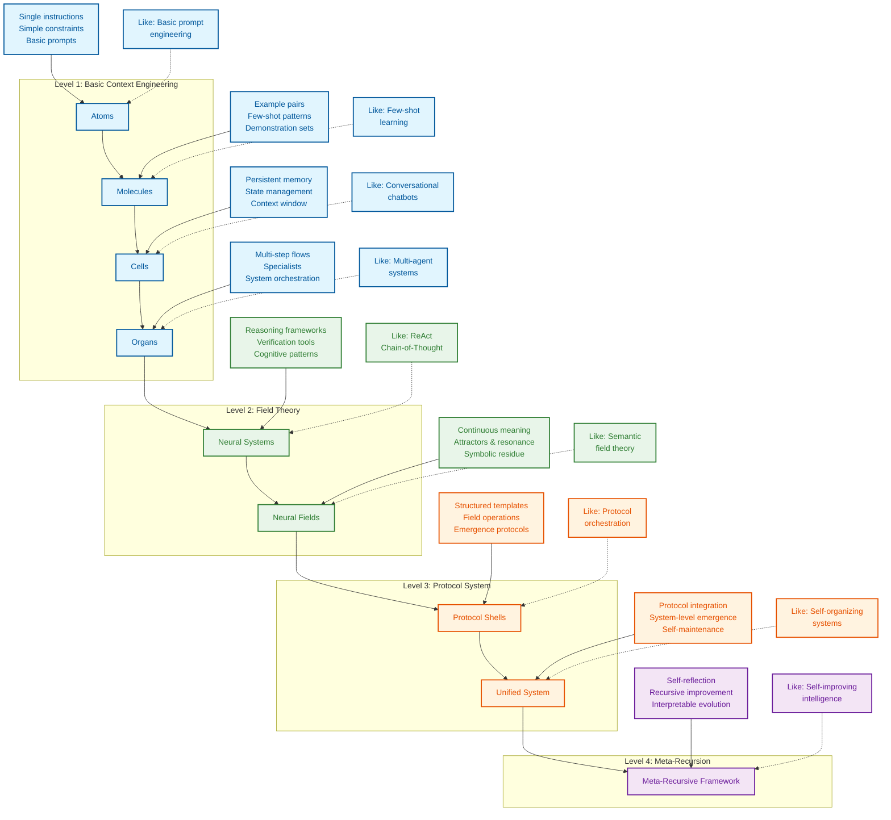

<div align="center">

# Context Engineering

</div>


> **"Context engineering is the delicate art and science of filling the context window with just the right information for the next step." — [**Andrej Karpathy**](https://x.com/karpathy/status/1937902205765607626)**
>
> [**Software Is Changing (Again) Talk @YC AI Startup School**](https://www.youtube.com/watch?v=LCEmiRjPEtQ)

<div align="center">

## [](https://deepwiki.com/davidkimai/Context-Engineering)


</div>

<div align="center">

 ## [DeepGraph](https://www.deepgraph.co/davidkimai/Context-Engineering)

## [Chat with NotebookLM + Podcast Deep Dive](https://notebooklm.google.com/notebook/0c6e4dc6-9c30-4f53-8e1a-05cc9ff3bc7e)

## [](https://discord.gg/JeFENHNNNQ)


</div>

## [Comprehensive Course Under Construction](https://github.com/davidkimai/Context-Engineering/tree/main/00_COURSE)

> ### **[Context Engineering Survey-Review of 1400 Research Papers](https://arxiv.org/pdf/2507.13334)**
>
> [**Awesome Context Engineering Repo**](https://github.com/Meirtz/Awesome-Context-Engineering)

Operationalizing the Latest Research on Context With First Principles & Visuals — July 2025 from ICML, IBM, NeurIPS, OHBM, and more


> **"Providing “cognitive tools” to GPT-4.1 increases its pass@1 performance on AIME2024 from 26.7% to 43.3%, bringing it very close to the performance of o1-preview."** — [**IBM Zurich**](https://www.arxiv.org/pdf/2506.12115)

<div align="center">

## [`Agent Commands`](https://github.com/davidkimai/Context-Engineering/tree/main/.claude/commands)
**Support for [Claude Code](https://www.anthropic.com/claude-code) | [OpenCode](https://opencode.ai/) | [Amp](https://sourcegraph.com/amp) | [Kiro](https://kiro.dev/) | [Codex](https://openai.com/codex/) | [Gemini CLI](https://github.com/google-gemini/gemini-cli)**

#### [Context Engineering Survey-Review of 1400 Research Papers](https://arxiv.org/pdf/2507.13334) | [Context Rot](https://research.trychroma.com/context-rot) | [IBM Zurich](https://www.arxiv.org/pdf/2506.12115) | [Quantum Semantics](https://arxiv.org/pdf/2506.10077) | [Emergent Symbolics ICML Princeton](https://openreview.net/forum?id=y1SnRPDWx4) | [MEM1 Singapore-MIT](https://arxiv.org/pdf/2506.15841) | [LLM Attractors Shanghai AI](https://arxiv.org/pdf/2502.15208?) | [MemOS Shanghai](https://github.com/MemTensor/MemOS) | [Latent Reasoning](https://arxiv.org/pdf/2507.06203) | [Dynamic Recursive Depths](https://arxiv.org/pdf/2507.10524)


</div>

A frontier, first-principles handbook for moving beyond prompt engineering to the wider discipline of context design, orchestration, and optimization.


```
                    Prompt Engineering  │  Context Engineering
                       ↓                │            ↓
               "What you say"           │  "Everything else the model sees"
             (Single instruction)       │    (Examples, memory, retrieval,
                                        │     tools, state, control flow)
```

## Definition of Context Engineering

> **Context is not just the single prompt users send to an LLM. Context is the complete information payload provided to a LLM at inference time, encompassing all structured informational components that the model needs to plausibly accomplish a given task.**
>
> — [**Definition of Context Engineering from A Systematic Analysis of Over 1400 Research Papers**](https://arxiv.org/pdf/2507.13334)

```
╭─────────────────────────────────────────────────────────────╮
│              CONTEXT ENGINEERING MASTERY COURSE             │
│                    From Zero to Frontier                    │
╰─────────────────────────────────────────────────────────────╯
                          ▲
                          │
                 Mathematical Foundations
                  C = A(c₁, c₂, ..., cₙ)
                          │
                          ▼
┌─────────────┬──────────────┬──────────────┬─────────────────┐
│ FOUNDATIONS │ SYSTEM IMPL  │ INTEGRATION  │ FRONTIER        │
│ (Weeks 1-4) │ (Weeks 5-8)  │ (Weeks 9-10) │ (Weeks 11-12)   │
└─────┬───────┴──────┬───────┴──────┬───────┴─────────┬───────┘
      │              │              │                 │
      ▼              ▼              ▼                 ▼
┌─────────────┐ ┌──────────────┐ ┌──────────────┐ ┌──────────────┐
│ Math Models │ │ RAG Systems  │ │ Multi-Agent  │ │ Meta-Recurs  │
│ Components  │ │ Memory Arch  │ │ Orchestrat   │ │ Quantum Sem  │
│ Processing  │ │ Tool Integr  │ │ Field Theory │ │ Self-Improv  │
│ Management  │ │ Agent Systems│ │ Evaluation   │ │ Collaboration│
└─────────────┘ └──────────────┘ └──────────────┘ └──────────────┘
```


## Why This Repository Exists

> **"Meaning is not an intrinsic, static property of a semantic expression, but rather an emergent phenomenon"
— [Agostino et al. — July 2025, Indiana University](https://arxiv.org/pdf/2506.10077)**

Prompt engineering received all the attention, but we can now get excited for what comes next. Once you've mastered prompts, the real power comes from engineering the **entire context window** that surrounds those prompts. Guiding thought, if you will.

This repository provides a progressive, first-principles approach to context engineering, built around a biological metaphor:

```
atoms → molecules → cells → organs → neural systems → neural & semantic field theory
  │        │         │         │             │                         │
single    few-     memory +   multi-   cognitive tools +     context = fields +
prompt    shot     agents     agents   operating systems     persistence & resonance
```
> "Abstraction is the cost of generalization"— [**Grant Sanderson (3Blue1Brown)**](https://www.3blue1brown.com/)


<div align="center">


*[A Survey of Context Engineering - July 2025](https://arxiv.org/pdf/2507.13334)*


 **[On Emergence, Attractors, and Dynamical Systems Theory](https://content.csbs.utah.edu/~butner/systems/DynamicalSystemsIntro.html) | [Columbia DST](http://wordpress.ei.columbia.edu/ac4/about/our-approach/dynamical-systems-theory/)**


https://github.com/user-attachments/assets/9f046259-e5ec-4160-8ed0-41a608d8adf3


</div>




## Quick Start

1. **Read [`00_foundations/01_atoms_prompting.md`](00_foundations/01_atoms_prompting.md)** (5 min)
   Understand why prompts alone often underperform

2. **Run [`10_guides_zero_to_hero/01_min_prompt.py`](10_guides_zero_to_hero/01_min_prompt.py)**  (Jupyter Notebook style)
   Experiment with a minimal working example

3. **Explore [`20_templates/minimal_context.yaml`](20_templates/minimal_context.yaml)**
   Copy/paste a template into your own project

4. **Study [`30_examples/00_toy_chatbot/`](30_examples/00_toy_chatbot/)**
   See a complete implementation with context management

## Learning Path

```
┌─────────────────┐     ┌──────────────────┐     ┌────────────────┐
│ 00_foundations/ │     │ 10_guides_zero_  │     │ 20_templates/  │
│                 │────▶│ to_one/          │────▶│                │
│ Theory & core   │     │ Hands-on         │     │ Copy-paste     │
│ concepts        │     │ walkthroughs     │     │ snippets       │
└─────────────────┘     └──────────────────┘     └────────────────┘
         │                                                │
         │                                                │
         ▼                                                ▼
┌─────────────────┐                             ┌────────────────┐
│ 40_reference/   │◀───────────────────────────▶│ 30_examples/   │
│                 │                             │                │
│ Deep dives &    │                             │ Real projects, │
│ eval cookbook   │                             │ progressively  │
└─────────────────┘                             │ complex        │
         ▲                                      └────────────────┘
         │                                                ▲
         │                                                │
         └────────────────────┐               ┌───────────┘
                              ▼               ▼
                         ┌─────────────────────┐
                         │ 50_contrib/         │
                         │                     │
                         │ Community           │
                         │ contributions       │
                         └─────────────────────┘
```

## What You'll Learn

| Concept | What It Is | Why It Matters |
|---------|------------|----------------|
| **Token Budget** | Optimizing every token in your context | More tokens = more $$ and slower responses |
| **Few-Shot Learning** | Teaching by showing examples | Often works better than explanation alone |
| **Memory Systems** | Persisting information across turns | Enables stateful, coherent interactions |
| **Retrieval Augmentation** | Finding & injecting relevant documents | Grounds responses in facts, reduces hallucination |
| **Control Flow** | Breaking complex tasks into steps | Solve harder problems with simpler prompts |
| **Context Pruning** | Removing irrelevant information | Keep only what's necessary for performance |
| **Metrics & Evaluation** | Measuring context effectiveness | Iterative optimization of token use vs. quality |
| **Cognitive Tools & Prompt Programming** | Learm to build custom tools and templates | Prompt programming enables new layers for context engineering |
| **Neural Field Theory** | Context as a Neural Field | Modeling context as a dynamic neural field allows for iterative context updating |
| **Symbolic Mechanisms** | Symbolic architectures enable higher order reasoning | Smarter systems = less work |
| **Quantum Semantics** |  Meaning as observer-dependent  | Design context systems leveraging superpositional techniques |


## Karpathy + 3Blue1Brown Inspired Style

> For learners of all experience levels

1. **First principles** – start with the fundamental context
2. **Iterative add-on** – add only what the model demonstrably lacks
3. **Measure everything** – token cost, latency, quality score
4. **Delete ruthlessly** – pruning beats padding
5. **Code > slides** – every concept has a runnable cell
6. **Visualize everything** — every concept is visualized with ASCII and symbolic diagrams

# Research Evidence
## Memory + Reasoning

### **[MEM1: Learning to Synergize Memory and Reasoning for Efficient Long-Horizon Agents - Singapore-MIT June 2025](https://www.arxiv.org/pdf/2506.15841)**

> “Our results demonstrate the promise of reasoning-driven memory consolidation as a scalable alternative to existing solutions for training long-horizon interactive agents, where both efficiency and performance are optimized." — [Singapore-MIT](https://arxiv.org/pdf/2506.15841)


1. **MEM1 trains AI agents to keep only what matters—merging memory and reasoning at every step—so they never get overwhelmed, no matter how long the task.**

2. **Instead of piling up endless context, MEM1 compresses each interaction into a compact “internal state,” just like a smart note that gets updated, not recopied.**

3. **By blending memory and thinking into a single flow, MEM1 learns to remember only the essentials—making agents faster, sharper, and able to handle much longer conversations.**

4. **Everything the agent does is tagged and structured, so each action, question, or fact is clear and easy to audit—no more mystery meat memory.**

5. **With every cycle, old clutter is pruned and only the latest, most relevant insights are carried forward, mirroring how expert problem-solvers distill their notes.**

6. **MEM1 proves that recursive, protocol-driven memory—where you always refine and integrate—outperforms traditional “just add more context” approaches in both speed and accuracy.**
## Cognitive Tools

### **[Eliciting Reasoning in Language Models with Cognitive Tools - IBM Zurich June 2025](https://www.arxiv.org/pdf/2506.12115)**

### Prompts and Prompt Programs as Reasoning Tool Calls
> “Cognitive tools” encapsulate reasoning operations within the LLM itself — [IBM Zurich](https://www.arxiv.org/pdf/2506.12115)


> **These cognitive tools (structured prompt templates as tool calls) break down the problem by identifying the main concepts at hand, extracting relevant information in the question, and highlighting meaningful properties, theorems, and techniques that
might be helpful in solving the problem.**


> **These templates scaffold reasoning layers similar to cognitive mental shortcuts, commonly studied as "heuristics".**

1. **This research shows that breaking complex tasks into modular “cognitive tools” lets AI solve problems more thoughtfully—mirroring how expert humans reason step by step.**

2. **Instead of relying on a single, big prompt, the model calls specialized prompt templates, aka cognitive tools like “understand question,” “recall related,” “examine answer,” and “backtracking”—each handling a distinct mental operation.**

3. **Cognitive tools work like inner mental shortcuts: the AI picks the right program at each stage and runs it to plan its reasoning and downstream actions before conducting the task for greater accuracy and flexibility.**

4. **By compartmentalizing reasoning steps into modular blocks, these tools prevent confusion, reduce error, and make the model’s thought process transparent and auditable—even on hard math problems.**

5. **This modular approach upgrades both open and closed models—boosting real-world math problem-solving and approaching the performance of advanced RL-trained “reasoning” models, without extra training.**

6. **The results suggest that the seeds of powerful reasoning are already inside large language models—cognitive tools simply unlock and orchestrate these abilities, offering a transparent, efficient, and interpretable alternative to black-box tuning.**
## Emergent Symbols

## **[Emergent Symbolic Mechanisms Support Abstract Reasoning in Large Language Models - ICML Princeton June 18, 2025](https://openreview.net/forum?id=y1SnRPDWx4)**


> **TL;DR: A three-stage architecture is identified that supports abstract reasoning in LLMs via a set of emergent symbol-processing mechanisms.**
>
>


**These include symbolic induction heads, symbolic abstraction heads, and retrieval heads.**

**1. In early layers, symbol abstraction heads convert input tokens to abstract variables based on the relations between those tokens.**

**2. In intermediate layers, symbolic induction heads perform sequence induction over these abstract variables.**

**3. Finally, in later layers, retrieval heads predict the next token by retrieving the value associated with the predicted abstract variable.**

**These results point toward a resolution of the longstanding debate between symbolic and neural network approaches, suggesting that emergent reasoning in neural networks depends on the emergence of symbolic mechanisms.** — [**ICML Princeton**](https://openreview.net/forum?id=y1SnRPDWx4)


>
> **Why Useful?**
>
>
> **This supports why Markdown, Json, and similar structured, symbolic formats are more easily LLM parsable**
>
> **Concept: Collaborate with agents to apply delimiters, syntax, symbols, symbolic words, metaphors and structure to improve reasoning/context/memory/persistence during inference**

1. **This paper proves that large language models develop their own inner symbolic “logic circuits”—enabling them to reason with abstract variables, not just surface word patterns.**

2. **LLMs show a three-stage process: first abstracting symbols from input, then reasoning over these variables, and finally mapping the abstract answer back to real-world tokens.**

3. **These emergent mechanisms mean LLMs don’t just memorize—they actually create internal, flexible representations that let them generalize to new problems and analogies.**

4. **Attention heads in early layers act like “symbol extractors,” intermediate heads perform symbolic reasoning, and late heads retrieve the concrete answer—mirroring human-like abstraction and retrieval.**

5. **By running targeted experiments and interventions, the authors show these symbolic processes are both necessary and sufficient for abstract reasoning, across multiple models and tasks.**

6. **The results bridge the historic gap between symbolic AI and neural nets—showing that, at scale, neural networks can invent and use symbolic machinery, supporting real generalization and reasoning.**


## Star History

[](https://www.star-history.com/#davidkimai/Context-Engineering&Date)

## Contributing

We welcome contributions! Check out [CONTRIBUTING.md](.github/CONTRIBUTING.md) for guidelines.

## License

[MIT License](LICENSE)

## Citation

```bibtex
@misc{context-engineering,
  author = {Context Engineering Contributors},
  title = {Context Engineering: Beyond Prompt Engineering},
  year = {2025},
  publisher = {GitHub},
  url = {https://github.com/davidkimai/context-engineering}
}
```

## Acknowledgements
> I've been looking forward to this being conceptualized and formalized as there wasn't a prior established field. Prompt engineering receives quite the stigma and doesn't quite cover what most researchers and I do.

- [Andrej Karpathy](https://x.com/karpathy/status/1937902205765607626) for coining "context engineering" and inspiring this repo
- All contributors and the open source community
