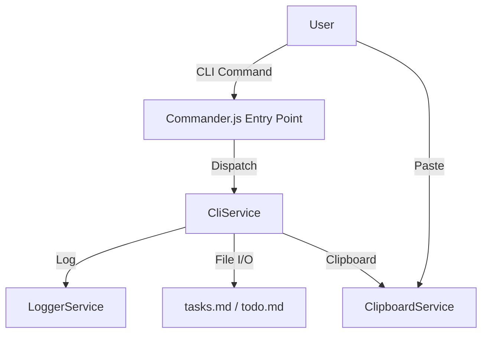

# Analysis Report: pew-pew-cli

**Source Repo:** [https://github.com/appboypov/pew-pew-cli](https://github.com/appboypov/pew-pew-cli)
**Analyzed Version:** `0.4.2` (via package.json)

## Executive Summary
**Verdict:** Partial Harvest.
The repository is a TypeScript-based CLI tool designed to manage developer tasks ("pew pew" tasks). While CodeSwarm is Python-based, the *concepts* of task management commands (`next`, `paste`, `reset`) are valuable for enhancing CodeSwarm's CLI (`main.py`) to allow human operators to interact with the agent's task queue dynamically. We should not port the code directly (language mismatch), but we should replicate the user experience.

## Architecture Diagram (Conceptual)

## Key Findings

### Pros
*   **Simple Task Workflow:** Focuses on "next task" and managing a markdown-based task list.
*   **Clipboard Integration:** Allows injecting tasks directly from clipboard, which is useful for "Human-in-the-Loop" where a user copies a bug report and pastes it into the agent's queue.
*   **Clean Facade:** `CliService` encapsulates logic well.

### Cons
*   **Language Mismatch:** TypeScript vs Python.
*   **Simple Logic:** The logic is trivial (file manipulation), so "harvesting" is mostly about copying the *feature set*, not complex algorithms.

## Harvest List

| Component | Description | Target Implementation |
| :--- | :--- | :--- |
| `paste` command | Pastes clipboard content into task list. | `codeswarm/cli.py` (New command) |
| `next` command | Advances/Shows next task. | `codeswarm/cli.py` (Interact with `codeswarm_state.json`) |
| `reset` command | Unchecks tasks. | `codeswarm/cli.py` |
| `CliService` | Architecture pattern. | `codeswarm/services/cli_service.py` |
