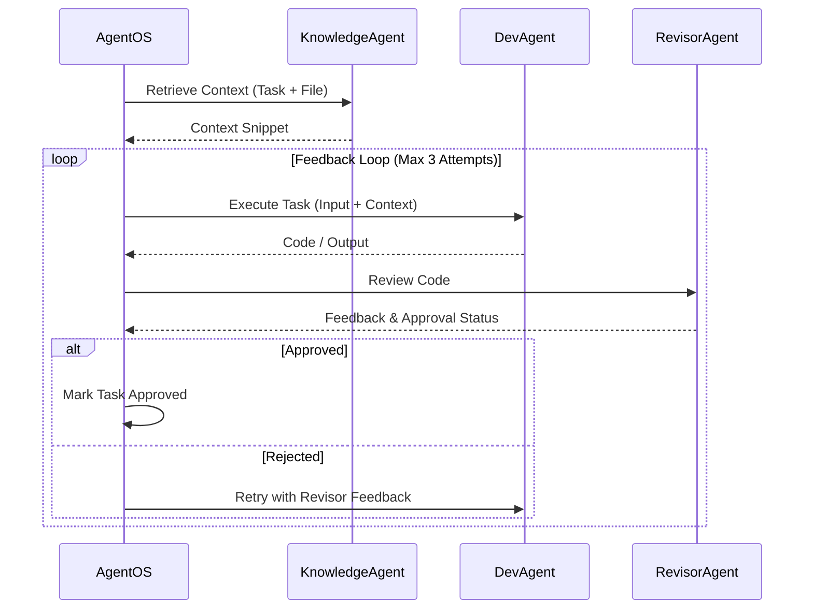

# Architecture Overview

CodeSwarm is designed as a hierarchical multi-agent system where a central orchestrator (`AgentOS`) manages the lifecycle of a software development project.

## High-Level Architecture

The system operates in **Rounds**. In each round, the system plans tasks, executes them in parallel, and logs the results.

```mermaid
graph TD
    User[User Command] --> Main[codeswarm/main.py]
    Main --> AOS[AgentOS (codeswarm/agent_os.py)]

    subgraph "AgentOS Run Loop"
        AOS --> StratPlan[Strategic Planning]
        StratPlan --> Plan[Planning Phase]
        Plan --> Exec[Execution Phase]
        Exec --> Log[Logging Phase]
        Log --> NextRound{Next Round?}
        NextRound -- Yes --> StratPlan
        NextRound -- No --> Finish[End]
    end
```

## The AgentOS Orchestrator

The `AgentOS` class (`codeswarm/agent_os.py`) is the core controller. It:
1.  **Maintains State**: Holds the `TaskTree` and `session_state`.
2.  **Manages Agents**: Instantiates Admin, Dev, Revisor, Planner, and Knowledge agents.
3.  **Persists Progress**: Saves state to `codeswarm_state.json` after every phase.

## Execution Phase Flow

The Execution Phase (`_execution_phase`) distributes tasks to Dev/Revisor pairs using a thread pool.



## Agent Roles

| Agent | Role | Definition |
| :--- | :--- | :--- |
| **AdminAgent** | Project Manager | Breaks down the goal into atomic tasks (`codeswarm/agents.py`). |
| **PlannerAgent** | Strategist | Analyzes the global state to update the high-level plan (`todo.md`). |
| **DevAgent** | Developer | Writes and executes code. Has access to `execute_python_code`. |
| **RevisorAgent** | QA / Reviewer | Validates code against requirements and quality standards. |
| **KnowledgeAgent**| Librarian | Retrieves relevant code patterns and context for the DevAgent. |
| **AdminLoggerAgent** | Scribe | Summarizes the round's activities. |

## Directory Structure Strategy

The system enforces operations within a `target_project_path` (default: `./generated_code`). Tools in `codeswarm/tools.py` include safety checks (`_is_safe_path`) to prevent modification of files outside this directory.
