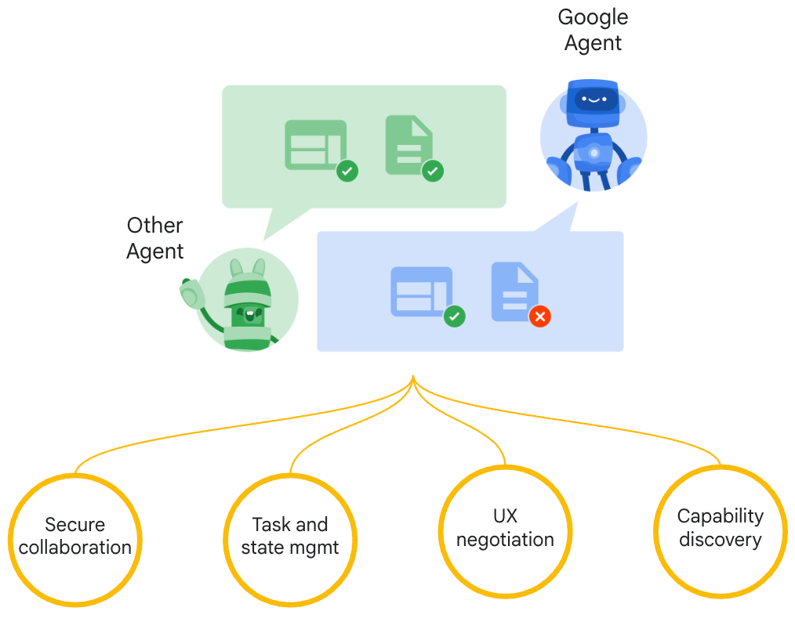

---
hide:
  - navigation
  - toc
---

# Agent2Agent (A2A) Protocol

{width="70%"}
{style="text-align: center; margin-bottom:1em; margin-top:1em;"}

## Unlock Collaborative Agent Scenarios

The **Agent2Agent (A2A) Protocol** is an open standard designed to enable seamless communication and collaboration between AI agents. In a world where agents are built using diverse frameworks and by different vendors, A2A provides a common language, breaking down silos and fostering interoperability.

- [Blog Post: Announcing the Agent2Agent Protocol (A2A)](https://developers.googleblog.com/en/a2a-a-new-era-of-agent-interoperability/)
- [Watch the A2A Demo Video](https://storage.googleapis.com/gweb-developer-goog-blog-assets/original_videos/A2A_demo_v4.mp4)

{width="50%"}
{style="text-align: center; margin-bottom:1em; margin-top:2em;"}

---

### Why A2A Matters

- :material-account-group-outline:{ .lg .middle } **Interoperability**

    Connect agents built on different platforms (LangGraph, CrewAI, Semantic Kernel, custom solutions) to create powerful, composite AI systems.

- :material-lan-connect:{ .lg .middle } **Complex Workflows**

    Enable agents to delegate sub-tasks, exchange information, and coordinate actions to solve complex problems that a single agent cannot.

- :material-shield-key-outline:{ .lg .middle } **Secure & Opaque**

    Agents interact without needing to share internal memory, tools, or proprietary logic, ensuring security and preserving intellectual property.

---

### A2A and MCP: Complementary Protocols

{width="60%"}
{style="text-align: center; margin-bottom:1em; margin-top:1em;"}

A2A and the [Model Context Protocol (MCP)](https://modelcontextprotocol.io/) are complementary standards for building robust agentic applications:

- **MCP (Model Context Protocol):** Connects agents to **tools, APIs, and resources** with structured inputs/outputs. Think of it as the way agents access their capabilities.
- **A2A (Agent2Agent Protocol):** Facilitates **dynamic, multimodal communication between different agents** as peers. It's how agents collaborate, delegate, and manage shared tasks.

[Learn more about A2A and MCP](./topics/a2a-and-mcp.md)

---

### Get Started with A2A

- :material-book-open:{ .lg .middle } **Read the Introduction**

    Understand the core ideas behind A2A.

    [:octicons-arrow-right-24: What is A2A?](./topics/what-is-a2a.md)

    [:octicons-arrow-right-24: Key Concepts](./topics/key-concepts.md)

- :material-file-document-outline:{ .lg .middle } **Dive into the Specification**

    Explore the detailed technical definition of the A2A protocol.

    [:octicons-arrow-right-24: Protocol Specification](./specification.md)

- :material-application-cog-outline:{ .lg .middle } **Follow the Tutorials**

    Build your first A2A-compliant agent with our step-by-step Python quickstart.

    [:octicons-arrow-right-24: Python Tutorial](./tutorials/python/1-introduction.md)

- :material-code-braces:{ .lg .middle } **Explore Code Samples**

    See A2A in action with sample clients, servers, and agent framework integrations.

    [:fontawesome-brands-github: GitHub Samples](https://github.com/google-a2a/A2A/tree/main/samples)

