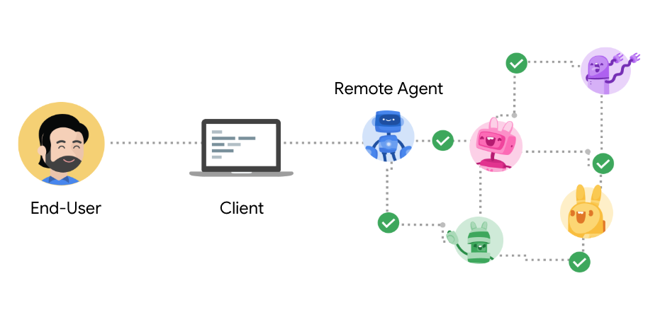

# Key Concepts in A2A

The Agent2Agent (A2A) protocol is built around a set of core concepts that define how agents interact. Understanding these concepts is crucial for developing or integrating with A2A-compliant systems.

{ width="70%" style="margin:20px auto;display:block;" }

## Core Actors

- **User:** The end-user (human or automated service) who initiates a request or goal that requires agent assistance.
- **A2A Client (Client Agent):** An application, service, or another AI agent that acts on behalf of the user to request actions or information from a remote agent. The client initiates communication using the A2A protocol.
- **A2A Server (Remote Agent):** An AI agent or agentic system that exposes an HTTP endpoint implementing the A2A protocol. It receives requests from clients, processes tasks, and returns results or status updates. The remote agent operates as an "opaque" system from the client's perspective, meaning the client doesn't need to know its internal workings, memory, or tools.

## Fundamental Communication Elements

- **Agent Card:**
    - A JSON metadata document, typically discoverable at a well-known URL (e.g., `/.well-known/agent.json`), that describes an A2A Server.
    - It details the agent's identity (name, description), service endpoint URL, version, supported A2A capabilities (like streaming or push notifications), specific skills it offers, default input/output modalities, and authentication requirements.
    - Clients use the Agent Card to discover agents and understand how to interact with them securely and effectively.
    - See details in the [Protocol Specification: Agent Card](../specification.md#5-agent-discovery-the-agent-card).

- **Task:**
    - When a client sends a message to an agent, the agent might determine that fulfilling the request requires a stateful task to be completed (e.g., "generate a report," "book a flight," "answer a question").
    - Each task has a unique ID defined by the agent and progresses through a defined lifecycle (e.g., `submitted`, `working`, `input-required`, `completed`, `failed`).
    - Tasks are stateful and can involve multiple exchanges (messages) between the client and the server.
    - See details in the [Protocol Specification: Task Object](../specification.md#61-task-object).

- **Message:**
    - Represents a single turn or unit of communication between a client and an agent.
    - Messages have a `role` (either `"user"` for client-sent messages or `"agent"` for server-sent messages) and contain one or more `Part` objects that carry the actual content. `messageId` part of the Message object is a unique identifier for each message set by the sender of the message.
    - Used for conveying instructions, context, questions, answers, or status updates that are not necessarily formal `Artifacts`.
    - See details in the [Protocol Specification: Message Object](../specification.md#64-message-object).

- **Part:**
    - The fundamental unit of content within a `Message` or an `Artifact`. Each part has a specific `type` and can carry different kinds of data:
        - `TextPart`: Contains plain textual content.
        - `FilePart`: Represents a file, which can be transmitted as inline base64-encoded bytes or referenced via a URI. Includes metadata like filename and MIME type.
        - `DataPart`: Carries structured JSON data, useful for forms, parameters, or any machine-readable information.
    - See details in the [Protocol Specification: Part Union Type](../specification.md#65-part-union-type).

- **Artifact:**
    - Represents a tangible output or result generated by the remote agent during the processing of a task.
    - Examples include generated documents, images, spreadsheets, structured data results, or any other self-contained piece of information that is a direct result of the task.
    - Artifacts are composed of one or more `Part` objects and can be streamed incrementally.
    - See details in the [Protocol Specification: Artifact Object](../specification.md#67-artifact-object).

## Interaction Mechanisms

- **Request/Response (Polling):**
    - The client sends a request (e.g., using the `message/send` RPC method) and receives a response from the server.
    - If the interaction requires a stateful long-running task, the server might initially respond with a `working` status. The client would then periodically call `tasks/get` to poll for updates until the task reaches a terminal state (e.g., `completed`, `failed`).

- **Streaming (Server-Sent Events - SSE):**
    - For tasks that produce results incrementally or provide real-time progress updates.
    - The client initiates an interaction with the server using `message/stream`.
    - The server responds with an HTTP connection that remains open, over which it sends a stream of Server-Sent Events (SSE).
    - These events can be `Task`, `Message`, or ``TaskStatusUpdateEvent` (for status changes) or `TaskArtifactUpdateEvent` (for new or updated artifact chunks).
    - This requires the server to advertise the `streaming` capability in its Agent Card.
    - Learn more about [Streaming & Asynchronous Operations](./streaming-and-async.md).

- **Push Notifications:**
    - For very long-running tasks or scenarios where maintaining a persistent connection (like SSE) is impractical.
    - The client can provide a webhook URL when initiating a task (or by calling `tasks/pushNotificationConfig/set`).
    - When the task status changes significantly (e.g., completes, fails, or requires input), the server can send an asynchronous notification (an HTTP POST request) to this client-provided webhook.
    - This requires the server to advertise the `pushNotifications` capability in its Agent Card.
    - Learn more about [Streaming & Asynchronous Operations](./streaming-and-async.md).

## Other Important Concepts

- **Context (`contextId`):** A server-generated identifier that can be used to logically group multiple related `Task` objects, providing context across a series of interactions.
- **Transport and Format:** A2A communication occurs over HTTP(S). JSON-RPC 2.0 is used as the payload format for all requests and responses.
- **Authentication & Authorization:** A2A relies on standard web security practices. Authentication requirements are declared in the Agent Card, and credentials (e.g., OAuth tokens, API keys) are typically passed via HTTP headers, separate from the A2A protocol messages themselves.
    - Learn more about [Enterprise-Ready Features](./enterprise-ready.md).
- **Agent Discovery:** The process by which clients find Agent Cards to learn about available A2A Servers and their capabilities.
    - Learn more about [Agent Discovery](./agent-discovery.md).

By understanding these core components and mechanisms, developers can effectively design, implement, and utilize A2A for building interoperable and collaborative AI agent systems.